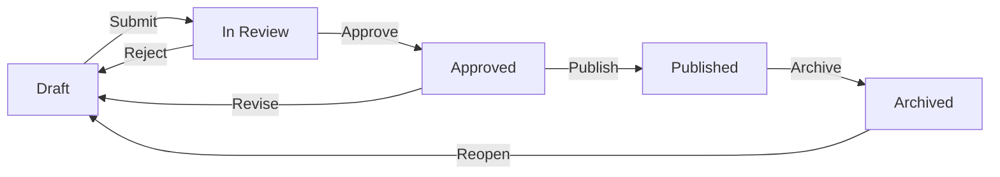

# PATHS Contributor Guide — Implementation Plan

> **For agentic workers:** REQUIRED SUB-SKILL: Use superpowers:subagent-driven-development (recommended) or superpowers:executing-plans to implement this plan task-by-task. Steps use checkbox (`- [ ]`) syntax for tracking.

**Goal:** Build a polished, web-based contributor onboarding guide using MkDocs Material, hosted at `guide.limitless-longevity.health`.

**Architecture:** MkDocs Material static site generated from Markdown files, deployed on Vercel as a separate project. Screenshots captured via Scribe Chrome extension. Source lives in `limitless-paths` repo under `docs/contributor-guide/`. LIMITLESS brand customization via CSS overrides.

**Tech Stack:** MkDocs, MkDocs Material theme, mkdocs-glightbox plugin, Vercel (static hosting), Cloudflare DNS, Scribe (screenshots)

**Spec:** `docs/superpowers/specs/2026-03-21-paths-contributor-guide-design.md`

---

## Important Notes

**This plan mixes code tasks and manual tasks.** Code tasks (MkDocs setup, Markdown content, CSS) can be executed by an agent. Manual tasks (marked with `[MANUAL]`) require the user to perform actions in browser (Scribe captures, Vercel setup, DNS).

**Screenshot placeholders:** Content pages will be written with placeholder image references (``). The user captures actual screenshots via Scribe and drops them into the assets directory. The guide is functional without screenshots (text instructions work standalone) but incomplete for onboarding until screenshots are added.

**Source material:** Reuse workflow descriptions and status definitions from existing admin guides at `learnhouse/docs/guides/editorial-workflow.md`, `role-setup.md`, and `pillar-management.md`. Reframe for the contributor audience (non-technical, action-oriented).

---

## File Structure

```
learnhouse/docs/contributor-guide/
├── mkdocs.yml                          — Site config, nav, theme, plugins
├── requirements.txt                    — Python dependencies
├── docs/
│   ├── index.md                        — Welcome & role selector
│   ├── getting-started/
│   │   ├── your-account.md             — Password, login, profile
│   │   └── finding-your-way.md         — Dashboard tour, terminology
│   ├── writing-articles/
│   │   ├── creating-an-article.md      — New article, first save
│   │   ├── using-the-editor.md         — Formatting, images, videos, versions
│   │   └── metadata-and-pillars.md     — Title, summary, pillar, access level
│   ├── editorial-workflow/
│   │   ├── how-it-works.md             — Flowchart, status table
│   │   ├── submitting-for-review.md    — Author perspective
│   │   └── reviewing-and-publishing.md — Editor/Publisher perspective
│   ├── reference/
│   │   ├── glossary.md                 — Platform terms A-Z
│   │   └── faq.md                      — Common questions
│   ├── assets/
│   │   ├── screenshots/                — Scribe-captured images (user adds)
│   │   └── diagrams/                   — Workflow flowcharts
│   └── stylesheets/
│       └── extra.css                   — LIMITLESS brand overrides + role badges
└── overrides/
    └── partials/
        └── (empty — reserved for future template overrides)
```

---

### Task 1: Scaffold MkDocs Project

**Files:**
- Create: `docs/contributor-guide/mkdocs.yml`
- Create: `docs/contributor-guide/requirements.txt`
- Create: `docs/contributor-guide/docs/stylesheets/extra.css`
- Create: `docs/contributor-guide/docs/assets/screenshots/.gitkeep`
- Create: `docs/contributor-guide/docs/assets/diagrams/.gitkeep`

- [ ] **Step 1: Create `requirements.txt`**

```
mkdocs-material>=9.5
mkdocs-glightbox>=0.4
```

- [ ] **Step 2: Create `mkdocs.yml`**

```yaml
site_name: PATHS Contributor Guide
site_url: https://guide.limitless-longevity.health
site_description: Your guide to creating content on the PATHS platform

theme:
  name: material
  palette:
    scheme: slate
    primary: custom
    accent: custom
  font:
    text: Inter
    code: Roboto Mono
  features:
    - navigation.sections
    - navigation.expand
    - navigation.top
    - navigation.footer
    - search.highlight
    - search.suggest
    - content.tabs.link
  icon:
    logo: material/book-open-page-variant

extra_css:
  - stylesheets/extra.css

plugins:
  - search
  - glightbox:
      touchNavigation: true
      loop: false
      effect: zoom
      slide_effect: slide
      width: 100%
      height: auto
      zoomable: true
      draggable: true

markdown_extensions:
  - admonition
  - pymdownx.details
  - pymdownx.superfences:
      custom_fences:
        - name: mermaid
          class: mermaid
          format: !!python/name:pymdownx.superfences.fence_code_format
  - pymdownx.tabbed:
      alternate_style: true
  - attr_list
  - md_in_html
  - pymdownx.emoji:
      emoji_index: !!python/name:material.extensions.emoji.twemoji
      emoji_generator: !!python/name:material.extensions.emoji.to_svg

nav:
  - Welcome: index.md
  - Getting Started:
    - Your Account: getting-started/your-account.md
    - Finding Your Way: getting-started/finding-your-way.md
  - Writing Articles:
    - Creating an Article: writing-articles/creating-an-article.md
    - Using the Editor: writing-articles/using-the-editor.md
    - Metadata & Pillars: writing-articles/metadata-and-pillars.md
  - Editorial Workflow:
    - How It Works: editorial-workflow/how-it-works.md
    - Submitting for Review: editorial-workflow/submitting-for-review.md
    - Reviewing & Publishing: editorial-workflow/reviewing-and-publishing.md
  - Reference:
    - Glossary: reference/glossary.md
    - FAQ: reference/faq.md
```

- [ ] **Step 3: Create `docs/stylesheets/extra.css`**

LIMITLESS brand overrides and role badge styles. Brand colors from the corporate site: gold `#C9A84C`, teal `#00B4D8`.

```css
/* LIMITLESS brand overrides */
:root {
  --md-primary-fg-color: #1a1a2e;
  --md-primary-bg-color: #ffffff;
  --md-accent-fg-color: #C9A84C;
  --md-typeset-a-color: #00B4D8;
}

[data-md-color-scheme="slate"] {
  --md-default-bg-color: #0f0f14;
  --md-default-fg-color: #e0e0e0;
  --md-accent-fg-color: #C9A84C;
  --md-typeset-a-color: #00B4D8;
}

/* Role badges */
.badge-all,
.badge-author,
.badge-editor {
  display: inline-block;
  padding: 2px 10px;
  border-radius: 12px;
  font-size: 0.75rem;
  font-weight: 600;
  letter-spacing: 0.02em;
  vertical-align: middle;
  margin-left: 8px;
}

.badge-all {
  background: rgba(34, 197, 94, 0.15);
  color: #22c55e;
  border: 1px solid rgba(34, 197, 94, 0.3);
}

.badge-author {
  background: rgba(59, 130, 246, 0.15);
  color: #3b82f6;
  border: 1px solid rgba(59, 130, 246, 0.3);
}

.badge-editor {
  background: rgba(168, 85, 247, 0.15);
  color: #a855f7;
  border: 1px solid rgba(168, 85, 247, 0.3);
}

/* Card grid for role selector */
.role-cards {
  display: grid;
  grid-template-columns: repeat(auto-fit, minmax(280px, 1fr));
  gap: 16px;
  margin: 24px 0;
}

.role-card {
  background: rgba(255, 255, 255, 0.04);
  border: 1px solid rgba(255, 255, 255, 0.08);
  border-radius: 12px;
  padding: 24px;
}

.role-card h3 {
  margin-top: 0;
}

/* Screenshot styling */
.md-typeset img {
  border-radius: 8px;
  border: 1px solid rgba(255, 255, 255, 0.1);
}
```

- [ ] **Step 4: Create placeholder directories**

```bash
mkdir -p docs/contributor-guide/docs/assets/screenshots
mkdir -p docs/contributor-guide/docs/assets/diagrams
mkdir -p docs/contributor-guide/overrides/partials
touch docs/contributor-guide/docs/assets/screenshots/.gitkeep
touch docs/contributor-guide/docs/assets/diagrams/.gitkeep
```

- [ ] **Step 5: Verify MkDocs builds**

```bash
cd docs/contributor-guide
pip install -r requirements.txt
mkdocs build
```

Expected: Build succeeds (will warn about missing pages — that's fine, we create them next).

- [ ] **Step 6: Commit**

```bash
git add docs/contributor-guide/
git commit -m "feat: scaffold MkDocs Material project for contributor guide"
```

---

### Task 2: Write Welcome Page

**Files:**
- Create: `docs/contributor-guide/docs/index.md`

- [ ] **Step 1: Write `index.md`**

Content per spec Section 4.1:
- Welcome paragraph in premium/concierge tone
- Role badge legend (🟢 🔵 🟣) explaining the system
- Two role cards (Author vs. Editor/Publisher) using the `.role-cards` CSS grid
- Quick Start call-to-action linking to `getting-started/your-account.md`

Use this structure:

```markdown
# Welcome to PATHS

Welcome to the PATHS platform — your workspace for creating world-class longevity content...

## Your Role

<div class="role-cards" markdown>
<div class="role-card" markdown>
### ✍️ Author
...
</div>
<div class="role-card" markdown>
### 📋 Editor / Publisher
...
</div>
</div>

## Guide Legend

| Badge | Meaning |
|-------|---------|
| <span class="badge-all">All Contributors</span> | ... |
| <span class="badge-author">Authors</span> | ... |
| <span class="badge-editor">Editors / Publishers</span> | ... |

## Get Started

[Set Up Your Account →](getting-started/your-account.md){ .md-button .md-button--primary }
```

- [ ] **Step 2: Verify build**

```bash
cd docs/contributor-guide && mkdocs build
```

- [ ] **Step 3: Commit**

```bash
git add docs/contributor-guide/docs/index.md
git commit -m "feat: add welcome page with role selector and guide legend"
```

---

### Task 3: Write Getting Started Pages

**Files:**
- Create: `docs/contributor-guide/docs/getting-started/your-account.md`
- Create: `docs/contributor-guide/docs/getting-started/finding-your-way.md`

- [ ] **Step 1: Write `your-account.md`**

Content per spec Section 4.2:
- Badge: `<span class="badge-all">All Contributors</span>` in heading
- 4 numbered steps with screenshot placeholders: receive email, set password, log in, set up profile
- Each step has a brief instruction paragraph + `` placeholder
- Admonition tip about bookmarking the URL

```markdown
# Your Account <span class="badge-all">All Contributors</span>

## Step 1: Check Your Email
...


## Step 2: Set Your Password
...

!!! tip
    Bookmark `paths.limitless-longevity.health` — this is your main entry point to the platform.
```

- [ ] **Step 2: Write `finding-your-way.md`**

Content per spec Section 4.3:
- Badge in heading
- Annotated screenshot placeholder of the dashboard
- Plain-language explanation of sidebar, articles section, profile menu
- Terminology admonition box defining: Dashboard, Organization, Pillar, Article, Draft

```markdown
!!! info "Key Terms"
    - **Dashboard** — Your workspace where you manage articles and view their status.
    - **Organization** — The team space where all content lives.
    - **Pillar** — A content category (e.g., Nutrition, Sleep).
    - **Article** — A piece of content you write on the platform.
    - **Draft** — An article that's being worked on, not yet visible to readers.
```

- [ ] **Step 3: Verify build**

```bash
cd docs/contributor-guide && mkdocs build
```

- [ ] **Step 4: Commit**

```bash
git add docs/contributor-guide/docs/getting-started/
git commit -m "feat: add getting started pages (account setup, dashboard tour)"
```

---

### Task 4: Write Article Creation Pages

**Files:**
- Create: `docs/contributor-guide/docs/writing-articles/creating-an-article.md`
- Create: `docs/contributor-guide/docs/writing-articles/using-the-editor.md`
- Create: `docs/contributor-guide/docs/writing-articles/metadata-and-pillars.md`

- [ ] **Step 1: Write `creating-an-article.md`**

Content per spec Section 4.4:
- Badge: All Contributors
- Step-by-step: Dashboard → Articles → "New Article" → editor
- Screenshot placeholders for each step
- Mini-exercise: "Create a test article"
- Admonition warning about auto-save vs. manual save

- [ ] **Step 2: Write `using-the-editor.md`**

Content per spec Section 4.5:
- Badge: All Contributors
- Editor toolbar reference (bold, italic, lists, headings, links) — describe each tool
- How to add images (screenshot placeholder of upload dialog)
- How to embed YouTube videos
- How to use callout boxes
- How to create tables
- Admonition tip: "Write in Google Docs first..."
- Version History section: viewing versions, restoring

- [ ] **Step 3: Write `metadata-and-pillars.md`**

Content per spec Section 4.6:
- Badge: All Contributors
- Screenshot placeholder of metadata sidebar
- Each field explained: Title, Slug, Summary, Featured image, Pillar, Access level
- List all 6 pillars with brief descriptions
- Admonition important: "Every article must have a Pillar before it can be published"

- [ ] **Step 4: Verify build**

```bash
cd docs/contributor-guide && mkdocs build
```

- [ ] **Step 5: Commit**

```bash
git add docs/contributor-guide/docs/writing-articles/
git commit -m "feat: add article creation, editor, and metadata guide pages"
```

---

### Task 5: Write Editorial Workflow Pages

**Files:**
- Create: `docs/contributor-guide/docs/editorial-workflow/how-it-works.md`
- Create: `docs/contributor-guide/docs/editorial-workflow/submitting-for-review.md`
- Create: `docs/contributor-guide/docs/editorial-workflow/reviewing-and-publishing.md`

**Source material:** Reframe content from `learnhouse/docs/guides/editorial-workflow.md` for the contributor audience.

- [ ] **Step 1: Write `how-it-works.md`**

Content per spec Section 4.7:
- Badge: All Contributors
- Mermaid flowchart of the editorial pipeline (use MkDocs Material's Mermaid support):

````markdown

````

- Status reference table with columns: Status, What it means, Who can move it forward, What happens next
- Admonition tip about status badges

- [ ] **Step 2: Write `submitting-for-review.md`**

Content per spec Section 4.8:
- Badge: Authors (🔵)
- "Submit for Review" button — screenshot placeholder with callout
- What happens after submission
- Handling rejection: finding feedback, revising, resubmitting
- Screenshot placeholder of feedback/notes area
- Admonition tip about rejection being collaborative

- [ ] **Step 3: Write `reviewing-and-publishing.md`**

Content per spec Section 4.9:
- Badge: Editors/Publishers (🟣)
- Note that both internal team members can perform all actions
- Content tabs using MkDocs Material tabbed syntax:

```markdown
=== "Reviewing"

    ### Finding Articles to Review
    ...

    ### Approving an Article
    ...

    ### Rejecting with Feedback
    ...

=== "Publishing"

    ### Publishing an Approved Article
    ...

    ### Archiving Content
    ...

    ### Reopening Archived Articles
    ...
```

- Admonition important about clear rejection feedback

- [ ] **Step 4: Verify build**

```bash
cd docs/contributor-guide && mkdocs build
```

- [ ] **Step 5: Commit**

```bash
git add docs/contributor-guide/docs/editorial-workflow/
git commit -m "feat: add editorial workflow pages (overview, submit, review/publish)"
```

---

### Task 6: Write Reference Pages

**Files:**
- Create: `docs/contributor-guide/docs/reference/glossary.md`
- Create: `docs/contributor-guide/docs/reference/faq.md`

- [ ] **Step 1: Write `glossary.md`**

Content per spec Section 4.10:
- Badge: All Contributors
- Alphabetical list using definition list format or simple table
- Terms: Archive, Article, Approved, Dashboard, Draft, Editor, In Review, Organization, Pillar, Published, Publisher, Slug, Summary, Version
- Each definition: 1-2 sentences, plain language

- [ ] **Step 2: Write `faq.md`**

Content per spec Section 4.11:
- Badge: All Contributors
- Q&A format using MkDocs Material details/admonition collapsible sections:

```markdown
??? question "I accidentally deleted my article. Can I recover it?"
    Unfortunately, deleted articles cannot be recovered...

??? question "Can I edit an article after it's published?"
    ...

??? question "Who can see my draft articles?"
    ...
```

- Each answer 2-3 sentences with cross-links to relevant guide pages

- [ ] **Step 3: Verify build**

```bash
cd docs/contributor-guide && mkdocs build
```

- [ ] **Step 4: Commit**

```bash
git add docs/contributor-guide/docs/reference/
git commit -m "feat: add glossary and FAQ reference pages"
```

---

### Task 7: Local Preview & Polish

**Files:**
- Modify: Various — fix cross-links, formatting, consistency

- [ ] **Step 1: Run local preview server**

```bash
cd docs/contributor-guide && mkdocs serve
```

Open `http://localhost:8000` in browser.

- [ ] **Step 2: Walk through every page**

Verify:
- All navigation links work
- Role badges render correctly with custom CSS
- Content tabs work on the reviewing/publishing page
- Mermaid flowchart renders
- Admonitions display properly (tip, warning, important, info, question)
- Glightbox works on images (once real screenshots are added)
- Search finds content across pages
- Mobile layout is readable (resize browser to ~375px)

- [ ] **Step 3: Fix any issues found**

Apply formatting fixes, broken links, CSS adjustments.

- [ ] **Step 4: Commit**

```bash
git add docs/contributor-guide/
git commit -m "fix: polish guide — fix links, formatting, and CSS"
```

---

### Task 8: Deploy to Vercel

**[MANUAL] — User performs in Vercel dashboard and Cloudflare**

- [ ] **Step 1: Create Vercel project**

Via Vercel dashboard or API:
- Import `limitless-paths` repo
- Name: `limitless-paths-guide`
- Root Directory: `docs/contributor-guide`
- Framework Preset: Other
- Build Command: `pip install -r requirements.txt && mkdocs build`
- Output Directory: `site`

- [ ] **Step 2: Add custom domain**

In Vercel project settings → Domains → Add `guide.limitless-longevity.health`

- [ ] **Step 3: Add DNS record**

In Cloudflare (via API or dashboard):
- Type: CNAME
- Name: `guide`
- Target: `cname.vercel-dns.com`
- Proxy: DNS only

- [ ] **Step 4: Verify deployment**

Wait for Vercel build + DNS propagation, then visit `https://guide.limitless-longevity.health`.

Expected: Guide loads with all pages, LIMITLESS branding, working navigation and search.

- [ ] **Step 5: Push code to production repo**

```bash
cd learnhouse
git add docs/contributor-guide/
git commit -m "feat: add contributor guide (MkDocs Material)"
git push production dev:main
```

This triggers auto-deploy on Vercel.

---

### Task 9: Capture Screenshots with Scribe

**[MANUAL] — User performs in browser with Scribe Chrome extension**

- [ ] **Step 1: Install Scribe Chrome extension**

Go to Chrome Web Store → search "Scribe" → install the free extension.

- [ ] **Step 2: Capture account setup flow**

Using Scribe, click through:
1. Password reset email (or simulate)
2. Password set page
3. Login page
4. Profile setup page

Export screenshots and save to `docs/contributor-guide/docs/assets/screenshots/` with names matching the placeholders in the Markdown files (e.g., `account-email.png`, `account-password.png`, `account-login.png`, `account-profile.png`).

- [ ] **Step 3: Capture dashboard tour**

Using Scribe, capture:
1. Dashboard overview (annotated)
2. Articles list view
3. Sidebar navigation

- [ ] **Step 4: Capture article creation flow**

Using Scribe, click through:
1. "New Article" button
2. Empty editor view
3. Editor with content (toolbar visible)
4. Metadata sidebar
5. Save action
6. Version history panel

- [ ] **Step 5: Capture editorial workflow actions**

Using Scribe, capture:
1. "Submit for Review" button
2. Status badge changes
3. Review/approve/reject interface
4. Rejection notes area
5. "Publish" button
6. Published status

- [ ] **Step 6: Drop screenshots into the assets directory**

Place all captured images in `docs/contributor-guide/docs/assets/screenshots/`. Ensure filenames match the `` references in the Markdown files.

- [ ] **Step 7: Commit and push**

```bash
git add docs/contributor-guide/docs/assets/screenshots/
git commit -m "feat: add Scribe-captured platform screenshots"
git push production dev:main
```

---

### Task 10: Configure Resend Email Provider

**[MANUAL] — User performs in Resend dashboard and Render**

This is a prerequisite for the "set your password" flow described in the guide.

- [ ] **Step 1: Create Resend account and verify domain**

Go to `resend.com` → sign up → add and verify `limitless-longevity.health` domain (requires DNS TXT/CNAME records in Cloudflare).

- [ ] **Step 2: Get API key**

Resend dashboard → API Keys → Create API Key → copy the key.

- [ ] **Step 3: Set env vars on Render**

Update the `paths-api` service environment variables:
- `LEARNHOUSE_RESEND_API_KEY` = (API key from step 2)
- `LEARNHOUSE_EMAIL_PROVIDER` = `resend` (already set)
- `LEARNHOUSE_SYSTEM_EMAIL_ADDRESS` = `noreply@limitless-longevity.health` (already set)

- [ ] **Step 4: Verify email sending**

Create a test user account in the admin panel → verify they receive the password reset email.

---

## Summary

| Task | Type | Description |
|------|------|-------------|
| 1. Scaffold MkDocs project | Code | mkdocs.yml, requirements.txt, CSS, directory structure |
| 2. Write welcome page | Code | index.md with role selector and guide legend |
| 3. Write getting started pages | Code | Account setup, dashboard tour |
| 4. Write article creation pages | Code | Creating articles, editor guide, metadata |
| 5. Write editorial workflow pages | Code | Overview flowchart, submit, review/publish |
| 6. Write reference pages | Code | Glossary, FAQ |
| 7. Local preview & polish | Code | Cross-links, formatting, CSS fixes |
| 8. Deploy to Vercel | Manual | Vercel project, DNS, verify |
| 9. Capture screenshots | Manual | Scribe captures of all platform flows |
| 10. Configure Resend email | Manual | Email provider for password reset flow |

**Code tasks (1-7): Can be executed by an agent in sequence.**
**Manual tasks (8-10): User-driven. Task 10 (Resend) can be done in parallel with tasks 1-7.**
