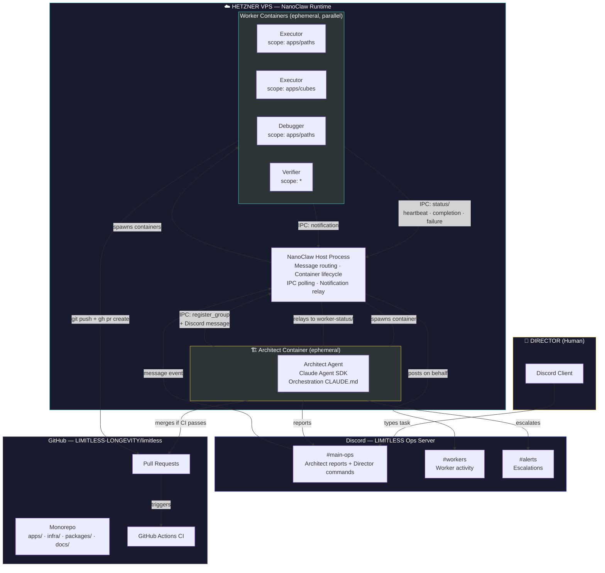
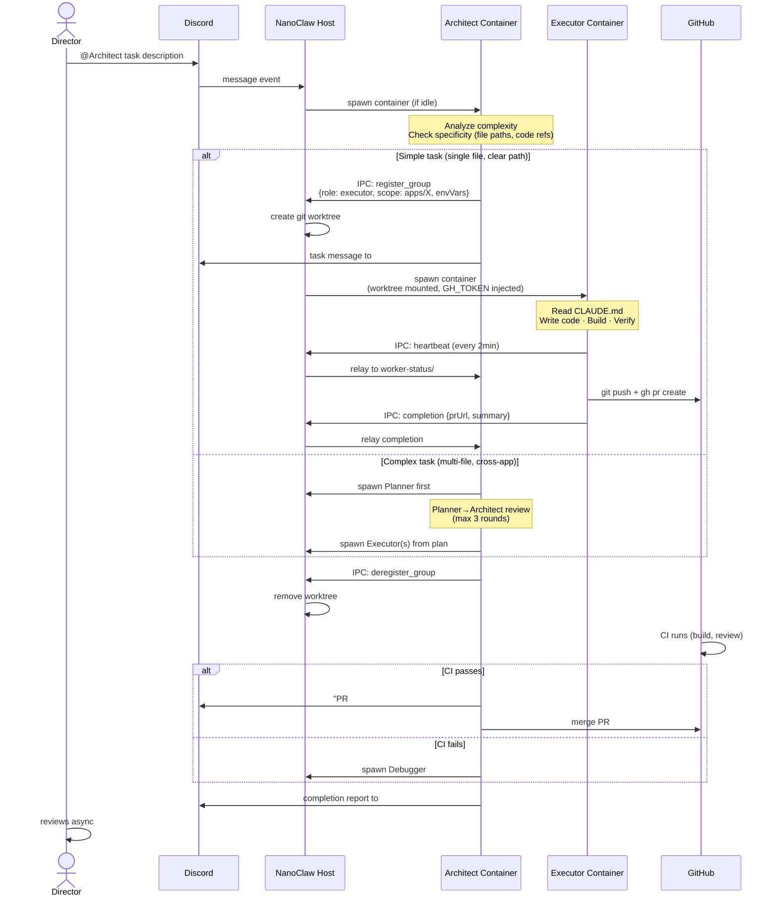
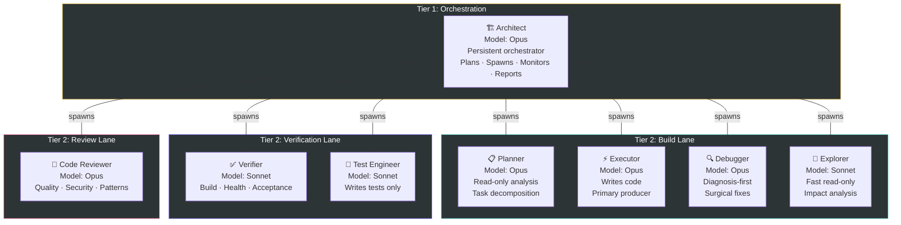
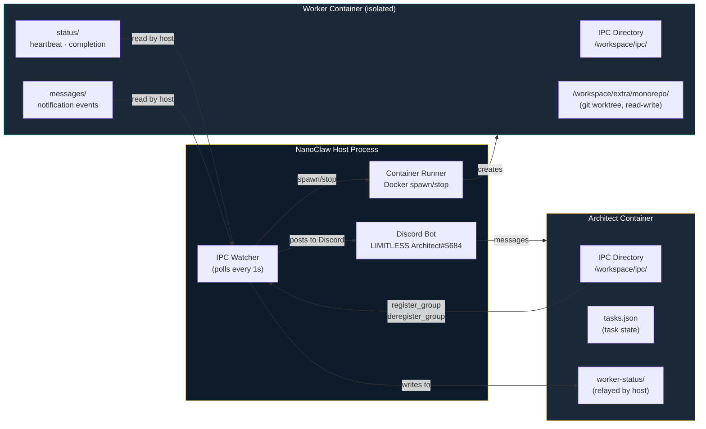
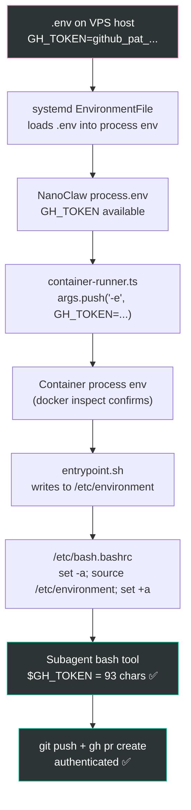
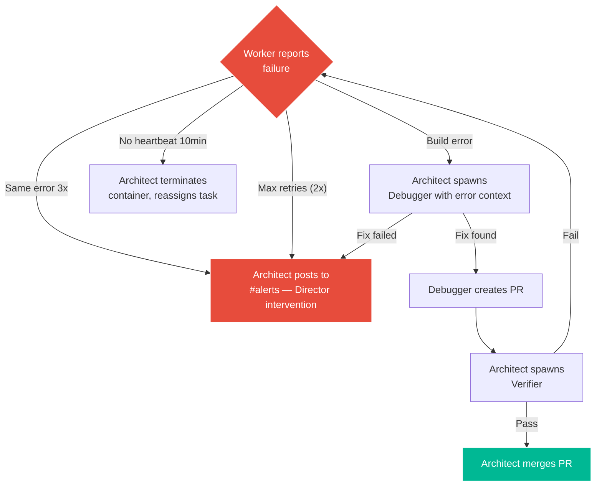
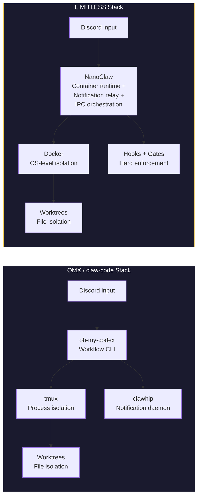

# LIMITLESS Agentic Software Development Division — Orchestration Architecture

**Date:** 2026-04-05
**Status:** OPERATIONAL — verified end-to-end 2026-04-05

---

## 1. High-Level Orchestration Flow

---

## 2. Task Lifecycle — From Director Command to Merged PR

---

## 3. Capability-Based Agent Catalog

---

## 4. Container Isolation & Communication

---

## 5. Credential Injection Chain

---

## 6. Failure Handling

---

## 7. Key Distinction from OMX

| Dimension | OMX | LIMITLESS |
|-----------|-----|-----------|
| **Container isolation** | tmux (process-level) | Docker (OS-level, kernel namespaces) |
| **Notification routing** | clawhip (separate daemon) | NanoClaw IPC relay (built-in) |
| **Credential model** | Local workstation env | 3-layer injection chain (IaC) |
| **Governance** | Prompt engineering | Hook + gate enforcement (code, not prose) |
| **Cloud deployment** | Not built-in | Hetzner VPS + systemd + Terraform |
| **Cost model** | API tokens ($3/MTok) | Max subscription ($100/mo flat) |
| **Agent spawning** | tmux split-window | Docker container spawn via IPC |
| **Crash recovery** | Event-sourced Rust engine | Filesystem tasks.json + heartbeat |
