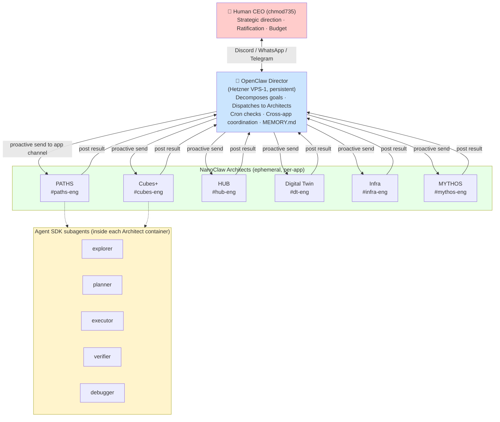
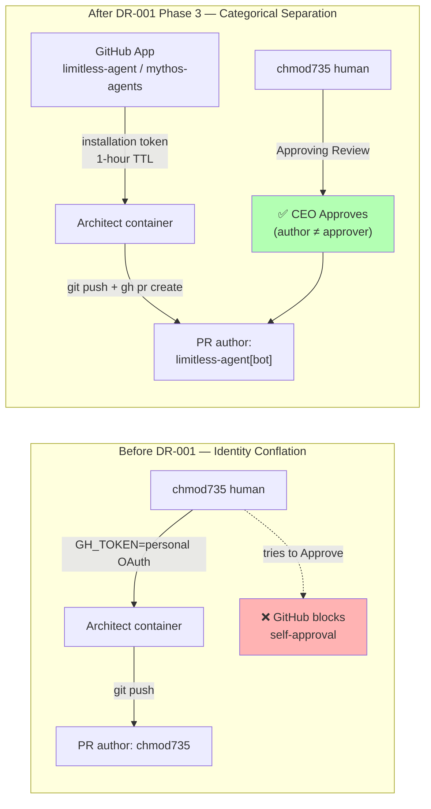
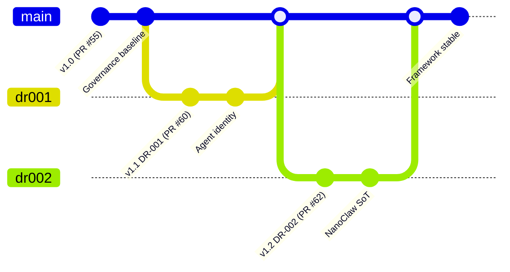
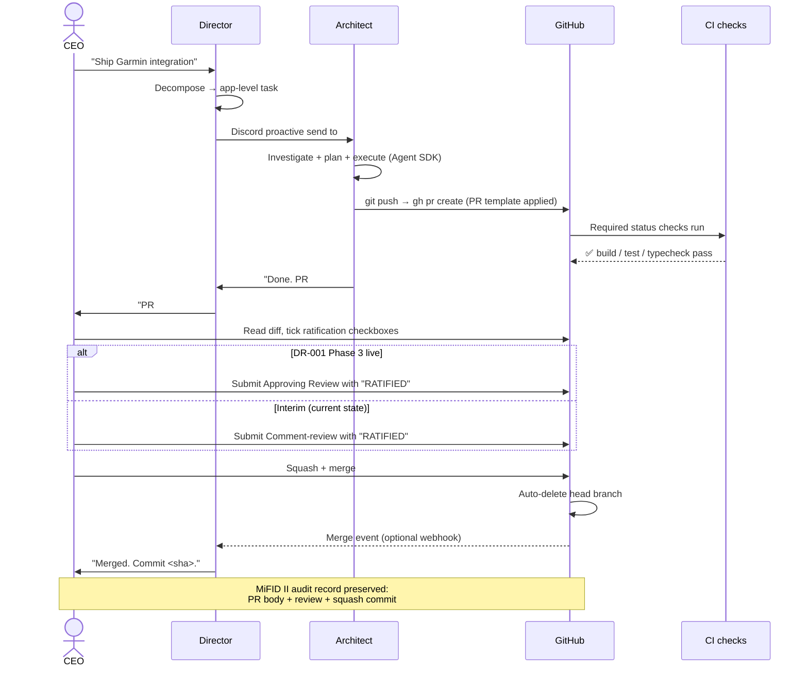
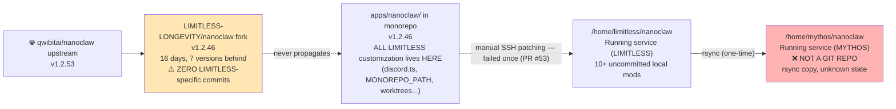
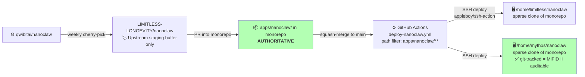
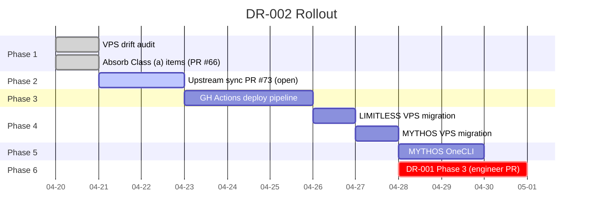
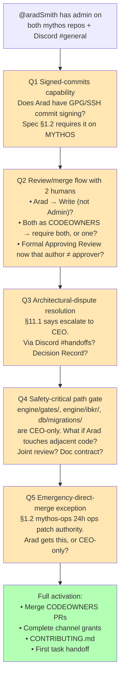
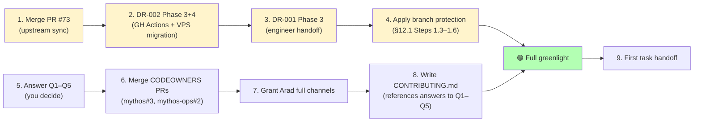

# Agentic SDLC — Phase 2 Readiness Report

**Date:** 2026-04-21
**Author:** Director (on CEO request)
**Classification:** Internal — Strategic
**Status:** Status report — no ratification required
**Purpose:** Comprehensive view of the agentic SDLC framework before onboarding the second (MYTHOS) dev team to co-develop with us

---

## Executive Summary

Over the last ~6 weeks we built, deployed and ratified a three-tier federated AI software division and wrote the governance that surrounds it. The framework is now **95% in place** — one engineer handoff (DR-001 Phase 3) remains to close the last audit gap, and the ratification flow has a known interim workaround in the meantime.

**Phase 1 (build the division) is effectively done.** Phase 2 is "let a second human team ship alongside us inside the same framework" — and that is the decision in front of you now.

**Three ratified Decision Records now govern everything we ship:**

| DR | Topic | Merged | Net effect |
|---|---|---|---|
| Governance spec v1.0 (PR #55) | Branch protection, review model, CODEOWNERS, MiFID II retention, PR templates, merge strategy, onboarding | 2026-04-18 | **Single operational playbook** for LIMITLESS + MYTHOS + all future repos |
| DR-001 (PR #60) | Agents are not humans — `[bot]` identity via GitHub Apps | 2026-04-20 | **Closes the self-approval loophole** and gives us cryptographically attributable audit records |
| DR-002 (PR #62) | Monorepo `apps/nanoclaw/` is the single NanoClaw source of truth; GH Actions → VPS deploy | 2026-04-20 | **Eliminates VPS drift**, makes MYTHOS NanoClaw MiFID II-auditable, gives DR-001 Phase 3 a landing target |

**What's live today:**
- 3-tier division: CEO → OpenClaw Director (Hetzner) → per-app NanoClaw Architects
- 5 Architect channels producing autonomous PRs (verified on 2026-04-03 with parallel #23 + #24)
- Governance + CODEOWNERS + PR templates on **all 3 repos** (LIMITLESS + mythos + mythos-ops)
- GitHub Apps registered, installed, credentials on both VPS tenants
- VPS drift audited; 5 class-(a) modifications absorbed into the monorepo (PR #66)

**What's still open:**
- DR-001 Phase 3 (App-token injection in `container-runner.ts`) — blocked on DR-002 Phase 4
- DR-002 Phase 2–7 (upstream sync in flight as PR #73, then pipeline + VPS migration)
- Branch protection not yet applied to any repo (by design — waiting for DR-001 Phase 3)
- **5 multi-human workflow decisions** blocking `@aradSmith`'s full activation

**Recommendation at the end of this doc:** Do NOT greenlight `@aradSmith` yet. We are one sprint away from being ready — let's close that sprint first so he walks into a stable framework on day 1, not a framework mid-mutation.

---

## 1. Three-Tier Federated Architecture

### 1.1 The tiers



### 1.2 Why three tiers (and not one)

We deliberately split orchestration from execution. v1 (single Architect managing all apps via Agent SDK subagents) worked but was an elaborate remote wrapper around Claude Code — we gained nothing over running Claude Code locally. v2 gets us what we actually wanted: **true parallel execution across apps**, because each Architect is a separate container listening on a separate channel.

| Tier | Concern | Tool |
|---|---|---|
| CEO | Direction + ratification | Human-language channels (Discord / WhatsApp / Telegram) |
| Director | Orchestration, memory, dispatch, cross-app coordination | OpenClaw persistent Gateway + cron + MEMORY.md |
| Architects | Code investigation + PR creation | NanoClaw containers + Agent SDK subagents |

### 1.3 What runs where

| Component | Host | Process | Persistence |
|---|---|---|---|
| OpenClaw Director | Hetzner VPS-1 (204.168.237.211) | systemd user service, native install v2026.4.9 | Persistent (always-on) |
| NanoClaw host daemon | Hetzner VPS-1 (LIMITLESS) + MYTHOS tenant | systemd service | Persistent |
| Architect containers | Hetzner VPS-1 | Docker, one per Architect channel | **Ephemeral** (spawned per task) |
| Monorepo worktrees | `/tmp/nanoclaw-worktrees/discord_{app}-eng/` | Git worktrees, one per task | Ephemeral |
| CLAUDE.md (per Architect) | `apps/nanoclaw/groups/discord_{app}-eng/CLAUDE.md` | Version-controlled in monorepo | Persistent |
| Architect state | `/workspace/group/` (mounted per container) | Files | Persistent across Architect invocations |

### 1.4 Verified capability

| Milestone | Date | Evidence |
|---|---|---|
| Autonomous investigation (no file paths given) | 2026-04-03 | PR #20 (PATHS lesson basePath) |
| **Parallel execution across Architects** | 2026-04-03 | PR #23 (Cubes+ health) + PR #24 (DT health+version) created **simultaneously** from different channels |
| OpenClaw Director bot-to-bot comms | 2026-04-11 | Full Director ↔ Architect ↔ CEO graph verified after `allowBots: true` fix |
| MYTHOS PRD and roadmap produced autonomously | 2026-04-03/04 | PRs #25, #26, #27 merged; Architect scored 8.5/10 vs Director's 7/10 |
| End-to-end governance ratification | 2026-04-18/20 | PRs #55, #60, #62 all ratified and squash-merged |

---

## 2. PR #60 — What It Resolved and Why It Matters

PR #60 is the pivot from "we have a working division" to "we have a working *auditable* division." Here is what it did and what it did not do.

### 2.1 The gap it closed

Governance spec v1 §5.1 requires a formal GitHub **Approving Review** for MiFID II ratification. But at the time, every NanoClaw Architect pushed commits using the CEO's personal `GH_TOKEN`. That meant every agent PR was authored by `chmod735`, and GitHub blocks self-approval: `chmod735` cannot formally Approve a PR authored by `chmod735`. The spec's own §5.1 condition #2 was **structurally unreachable**.

PR #60 (DR-001 + spec v1.1 + rollout plan) made the call: agents are not humans — they get their own `[bot]` identity via GitHub Apps. CEO can then formally Approve their PRs, and the audit record becomes a clean three-layer hierarchy.

### 2.2 Identity model before vs after



### 2.3 The three-layer attribution hierarchy

Every agent-authored commit now carries three attribution layers:

| Layer | What it records | Where it appears | Example |
|---|---|---|---|
| **GitHub author** | Which bot system pushed | Commit history, PR author field, org audit log | `limitless-agent[bot]` |
| **AI model** | Which model generated the content | Commit message footer trailer | `Co-Authored-By: Claude Opus 4.7 <noreply@anthropic.com>` |
| **Per-agent attribution** (optional LIMITLESS, recommended MYTHOS) | Which Architect authored — distinguishes PATHS vs Cubes+ vs... | Commit body footer | `Authored-by-agent: PATHS Architect` |
| **Ratifier** | Which human approved + merged | Squash-merge commit author + PR "Approved by" | `chmod735` |

### 2.4 What PR #60 delivered

Three files, 683 lines added:

| File | What |
|---|---|
| `docs/decisions/DR-001-agent-identity-and-ratification-flow.md` | Full decision record — 4 options evaluated (single bot / per-agent bots / **GitHub Apps** / signed-commits-only), rationale, consequences, self-correction path |
| `docs/superpowers/specs/2026-04-18-agentic-sdlc-governance.md` | Spec amended to v1.1 — §5.1 fixed, §8 gains attribution hierarchy, §11.1 AI Architect row shows `[bot]` |
| `docs/plans/agent-identity-rollout.md` | 7-phase implementation plan with verification checklists, token rotation procedure, recovery procedures for 4 failure modes |

### 2.5 PR #60's post-merge rollout state

| Phase | Status | Done by |
|---|---|---|
| 0 — Ratify DR-001 audit record | ✅ Done (rebased onto DR-002's `8b627823`, conflict-resolved, squash-merged as `869f1c95`) | Architect + Director + CEO |
| 1 — Register + install both Apps | ✅ Done (Mythos app re-registered correctly under `chmod735-dor` after initial misroute) | CEO |
| 2 — VPS credential staging | ✅ Done (`.pem` keys at `/home/{limitless,mythos}/nanoclaw/keys/*.pem` mode 600; env vars set on both tenants) | Director |
| 3 — `container-runner.ts` token generation | ⏳ **BLOCKED on DR-002 Phase 4** (VPS migration to monorepo clone); engineer handoff not filed yet | — |

**Interim state:** Agents still push using `chmod735`'s `GH_TOKEN`. The Comment-type review + `RATIFIED` keyword workaround remains in effect. Audit record content is equivalent (same PR, same timestamp, same attribution, grep-able keyword) but it is not the formal §5.1 flow.

### 2.6 Why this matters for onboarding a second team

Once DR-001 Phase 3 lands, every future PR author is **either a human GitHub handle or a `[bot]` identity**. `@aradSmith`'s PRs are clearly human; agent PRs are clearly bot; CEO's own PRs are clearly CEO. An auditor (MiFID II or security) can tell in a glance which category a merge came from. Today, everything looks like `chmod735` authored everything — and that misrepresentation grows worse as we add a second human.

---

## 3. Governance Framework (Spec v1.2)

### 3.1 The spec arc



| Version | PR | Date | What it added |
|---|---|---|---|
| v1.0 | #55 (`5cae9e35`) | 2026-04-18 | 12 sections — branch protection, review model (9-row table), CODEOWNERS, MiFID II ratification, commit conventions, merge strategy, PR templates, versioning, rollout |
| v1.1 | #60 (`869f1c95`) | 2026-04-20 | DR-001 — §5.1 ratification flow with agent identity decoupled; §8 attribution hierarchy + `Authored-by-agent:` footer; §11.1 shows `[bot]` identity |
| v1.2 | #62 (`8b627823`) | 2026-04-20 | DR-002 — monorepo as NanoClaw source-of-truth; 3 new open questions (VPS audit, MYTHOS OneCLI port, v2 upgrade timeline) |

Canonical location: `docs/superpowers/specs/2026-04-18-agentic-sdlc-governance.md` on `LIMITLESS-LONGEVITY/limitless` main.

### 3.2 Core principles (from §Executive Summary)

1. **Agents propose; humans ratify.** No agent merges to `main`.
2. **Every merge is a timestamped, attributable record.** (DR-001 restores the attribution.)
3. **Safety-critical paths have stricter gates and narrower ownership.**
4. **The governance model is itself versioned and PR-governed** — this spec evolves by the same rules it imposes.

### 3.3 Review model (the 9-row table)

| Change class | Author | Automated gates | Human approver | Notes |
|---|---|---|---|---|
| MYTHOS — Safety-critical (`engine/gates/`, `engine/ibkr/`, `db/migrations/`) | Architect/Engineer | Build + tests + `gate-invariant-check` | **CEO + Safety Reviewer** (Phase 3+) | DR required for every non-trivial choice |
| MYTHOS — Planning deliverables (Charter, SOW, SRS, FRS, DDS, SDD) | MYTHOS Architect | Ratification checklist in PR body | CEO (checklist ticked + "RATIFIED") | MiFID II audit record |
| MYTHOS — Decision Records | MYTHOS Architect | None | CEO | DR-NNN files; lightweight |
| MYTHOS — Implementation (non-safety) | Architect/Engineer | Build + tests | CEO | `sidecar/`, `docs/`, non-gate code |
| MYTHOS — Infrastructure | MYTHOS Architect | Docker build smoke | CEO | Schema migrations require DR |
| LIMITLESS — App code | Per-app Architect | `pnpm build` + tests | CEO | Normal dev cycle |
| LIMITLESS — Infra | Infra Architect | `terraform plan` in PR body | CEO | Plan output required |
| NanoClaw — Tier 3 behavioral | Architect | Build + vitest | CEO | Follows self-mod governance |
| Governance/spec docs | Architect | None | CEO | This document is an example |

Agent-to-agent review is **advisory only**. It does not substitute for CEO approval on any path.

### 3.4 Branch protection (policy written, not yet applied)

Branch protection is deliberately **not yet applied** to any of the 3 repos. The spec defines it strictly (§1.2) but we intentionally deferred rollout Step 1.3 until DR-001 Phase 3 ships. Why: the moment we apply "require 1 approving review" with the current CEO-token identity model, every agent PR becomes structurally unmergeable.

| Setting | Universal baseline | MYTHOS addition |
|---|---|---|
| Require PR before merging | ✅ | ✅ |
| Required approving reviews | 1 (CEO) | 1 (CEO) → CEO + Safety Reviewer (Phase 3+) |
| Dismiss stale reviews on new commits | ✅ | ✅ |
| Require review from Code Owners | ✅ | ✅ |
| Require branches up to date | ✅ | ✅ |
| Require conversation resolution | ✅ | ✅ |
| Restrict who can push | CEO admins only | CEO admins only |
| Allow force pushes / deletions | ❌ | ❌ |
| **Require signed commits** | — | ✅ **MYTHOS only** (MiFID II) |
| **Require linear history** | — | ✅ **MYTHOS only** (clean audit chain) |

### 3.5 Ratification mechanism (MiFID II Art. 25 compliant)

A merge is ratified when ALL are true:

1. All PR-body ratification checkboxes ticked
2. CEO submits a GitHub **Approving Review** (not a Comment)
3. Review body contains `RATIFIED` or `Approved`
4. All required status checks pass
5. No unresolved review conversations

**Retention:** GitHub native retention indefinitely + weekly/daily `gh api` export to operator-controlled WORM storage (Backblaze B2 / S3 Object Lock). MiFIR Art. 25(1) mandates 5 years; Ireland CBI extends to 7; our design target is 7.

### 3.6 The ratification flow, visualised



### 3.7 Commit message contract

```
type(scope): subject line ≤72 chars

Body: what and why (not how). Wrap at 72 chars.
Multiple paragraphs allowed.

Footer:
Authored-by-agent: PATHS Architect          ← required for MYTHOS, recommended for LIMITLESS
ROADMAP-REF: P1-INFRA-001                   ← when linking to a ROADMAP ticket
Reviewed-by: CEO
Co-Authored-By: Claude Opus 4.7 <noreply@anthropic.com>
```

**Merge strategy:** squash-merge + delete branch, always. Merge commits and rebase-merges are disabled. One commit per PR = one ratification decision = one atomic audit record.

### 3.8 Rollout state across repos (CODEOWNERS + PR templates)

| Repo | Rollout PR | Status | Merge commit |
|---|---|---|---|
| `chmod735-dor/mythos` | #2 | ✅ Merged 2026-04-19 | First-ever merge under new governance |
| `chmod735-dor/mythos-ops` | #1 | ✅ Merged 2026-04-20 | `94a73893` |
| `LIMITLESS-LONGEVITY/limitless` | #59 | ✅ Merged 2026-04-20 | `96262ff8` |

All 3 repos now have CODEOWNERS + `pull_request_template.md`. Branch protection application (§12.1 Steps 1.3–1.6) is deferred pending DR-001 Phase 3 + multi-human workflow decisions.

---

## 4. DR-002 — NanoClaw Source of Truth and Deploy Pipeline

### 4.1 Problem it solved

Three copies of NanoClaw existed, drifting independently:



The manual-propagation pattern (merge monorepo → Director SSH-patches VPS) failed once already on PR #53. MYTHOS's deployed tree isn't even a git repo — **it has no audit trail**, which is incompatible with MiFID II.

### 4.2 DR-002 decision

**Option B chosen**: `apps/nanoclaw/` in the monorepo is authoritative. GitHub Actions SSH-deploys to both VPS tenants on merge to `main`. Fork is retained only as an upstream-staging buffer.



### 4.3 Why this was the gating decision for DR-001 Phase 3

DR-001 Phase 3 needs to land in `container-runner.ts` and be deployed to both VPS tenants. Before DR-002, "which tree gets the change and how does it reach the VPS" had no answer. DR-002 gave it one: **land the PR in `apps/nanoclaw/` in the monorepo, and the pipeline deploys it.**

Hence DR-001 Phase 3 is sequenced *after* DR-002 Phase 4 (VPS migration to monorepo clone).

### 4.4 DR-002 rollout state

| Phase | What | Status |
|---|---|---|
| 1 — VPS drift audit | Classify the 10 "modified" files | ✅ Done (2026-04-20). 7 byte-identical to origin/main; 3 absorbed + 2 new files |
| 1.3 — Absorb Class (a) items | Pull real local mods into monorepo | ✅ Done (PR #66 `50ca8031`). Added `container/entrypoint.sh`, `discord.test.ts` (777-line vitest suite), Dockerfile pnpm+COPY pattern, container-runner `.git` passthrough |
| 2 — Monorepo upstream sync | 1.2.46 → 1.2.53 | ⏳ **PR #73 open** (filed 2026-04-21 — CI passing, awaiting ratification). Adds `ONECLI_API_KEY`, `session-cleanup.ts`, version bump |
| 3 — GitHub Actions deploy pipeline | `appleboy/ssh-action` + command-restricted deploy key | Pending |
| 4 — VPS clone migration | LIMITLESS multi-remote clone → monorepo sparse clone; MYTHOS rsync → git clone | Pending (unlocks DR-001 Phase 3) |
| 5 — MYTHOS OneCLI provisioning | Own instance on different port (LIMITLESS = 10254) | Pending |
| 6 — DR-001 Phase 3 implementation | `container-runner.ts` mints App installation token at spawn | Pending — engineer handoff filed only after Phases 3+4 done |
| 7 — Ongoing upstream sync protocol | Weekly check + collision table | Documented |

### 4.5 Where we are on DR-002 rollout (as of 2026-04-21)



Realistic end-to-end: **~1.5 sprints** to reach fully-automated deploy + bot-identity PRs.

---

## 5. Current State Matrix

One table per concern, so you can scan.

### 5.1 Division v2 infrastructure

| Component | State | Notes |
|---|---|---|
| OpenClaw Director on Hetzner VPS-1 | ✅ Live | Native install v2026.4.9, Node 24.14.1 via fnm, systemd user service |
| Per-app Architect CLAUDE.md | ✅ 5 live (PATHS, Cubes+, HUB, DT, Infra) | `apps/nanoclaw/groups/discord_{app}-eng/CLAUDE.md` |
| MYTHOS Architect | ✅ Running in `chmod735-dor/mythos` separately | CLAUDE.md live; produced PRD + roadmap autonomously |
| Parallel execution verified | ✅ Yes | PR #23 + #24 concurrent creation (2026-04-03) |
| Director ↔ Architect ↔ CEO comms | ✅ All three edges verified | `allowBots: true` fix was the final unlock (2026-04-11) |
| Multi-channel CEO interface | ✅ Discord confirmed | WhatsApp + Telegram supported by OpenClaw but currently unused |
| Cross-app coordination | ⏳ Manual | Phase 4 feature — OpenClaw detects API-contract changes from PR diffs (deferred) |
| Fleet automation (Terraform + Ansible) | ⏳ Foundation in place | `infra-code` repo has module + 6 roles; full auto-scale deferred |

### 5.2 Governance + identity

| Concern | State | Blocker |
|---|---|---|
| Governance spec v1.2 | ✅ Ratified, on main (LIMITLESS) | — |
| DR-001 audit record | ✅ Ratified (PR #60) | — |
| DR-002 audit record | ✅ Ratified (PR #62) | — |
| GitHub Apps registered | ✅ `limitless-agent` + `mythos-agents` | — |
| GitHub Apps installed | ✅ All 3 repos | — |
| VPS credential staging (both tenants) | ✅ Done | — |
| Bot-identity PR authorship (DR-001 Phase 3) | ❌ Not live | Blocked on DR-002 Phase 4 |
| Formal Approving Review flow | ⏳ Interim (Comment-review + `RATIFIED`) | Unlocks with Phase 3 |
| Branch protection applied | ❌ Not yet | Deliberately deferred until Phase 3 |
| CODEOWNERS + PR template | ✅ All 3 repos | — |

### 5.3 NanoClaw source of truth

| Concern | State |
|---|---|
| VPS drift audit complete | ✅ Phase 1 done |
| Class (a) items absorbed | ✅ PR #66 merged |
| Upstream sync to 1.2.53 | ⏳ PR #73 open (CI green) |
| GH Actions deploy pipeline | ❌ Pending (Phase 3) |
| LIMITLESS VPS = monorepo clone | ❌ Still multi-remote clone |
| MYTHOS VPS = git clone | ❌ Still rsync copy (MiFID II gap) |
| MYTHOS OneCLI provisioned | ❌ Pending |
| Upstream sync protocol documented | ✅ In rollout plan |

### 5.4 MYTHOS-specific

| Concern | State |
|---|---|
| MYTHOS repo (`chmod735-dor/mythos`) live | ✅ |
| MYTHOS-ops repo (`chmod735-dor/mythos-ops`) live | ✅ |
| Product Brief + PRD merged | ✅ PRs #25 (Charter), #26, #27 |
| Phase 1 roadmap + Kanban | ✅ PR #27 |
| MYTHOS Architect identity CLAUDE.md | ✅ PR #50 |
| GitLab + Jira adoption impact assessment | ✅ PR #54 |

### 5.5 Collaborator onboarding (`@aradSmith` / `aradsky`)

| Step | Status |
|---|---|
| 1 — GitHub admin on both mythos repos | ✅ Added |
| 2 — CODEOWNERS PR (mythos #3) | ⏳ Open, awaiting ratification |
| 2 — CODEOWNERS PR (mythos-ops #2) | ⏳ Open, awaiting ratification |
| 3 — Discord D.O.R OPS guild membership | ✅ Joined |
| 3 — Full channel grants (`#main-ops`, `#mythos-eng`, `#handoffs`, `#humans`) | ❌ Currently `#general` only |
| 4 — Multi-human workflow decisions | ❌ **Blocking full activation** |
| 5 — CONTRIBUTING.md for MYTHOS | ❌ Pending Step 4 |
| 6 — First task / first PR | ❌ Pending Steps 3–5 |

---

## 6. Onboarding Readiness for @aradSmith

### 6.1 The five decisions blocking full activation

These are not engineering questions — they are operator decisions that nobody can answer without you. The framework is ready for a second human, but these call-outs are missing:



### 6.2 Recommended answers (my read — you decide)

| # | Question | Suggestion | Rationale |
|---|---|---|---|
| Q1 | Signed commits | Require before activation. Have Arad configure GPG or SSH commit signing as part of CONTRIBUTING.md. | MYTHOS is MiFID II-regulated. Cryptographic authorship is part of the audit story. Cheap to set up once, impossible to retrofit cleanly. |
| Q2a | Arad's permission level | Move from Admin → **Write** once CODEOWNERS PRs merge | Spec §11.1 — "Collaborating team lead — cannot merge". Admin is fine for bootstrap, Write is the steady state. |
| Q2b | CODEOWNERS joint-reviewer semantics | **One-of-both suffices** on most paths; **both-required** on safety-critical (when both are in CODEOWNERS there). | GitHub's CODEOWNERS doesn't natively distinguish these — we encode it via the "Required approving reviews" count in branch protection (1 = any owner; 2 = both if both are owners). |
| Q2c | Formal Approving Review for Arad's PRs | **Yes — works today.** Arad's author ≠ CEO's approver; GitHub's self-approval block doesn't apply. Human-to-human is the clean case. | This is why DR-001 matters: the self-approval block only affected agent PRs. Human-to-human has always worked. |
| Q3 | Architectural disputes | **Decision Record in `docs/decisions/DR-NNN-...`** authored by whichever side opens the dispute, ratified by CEO. Discussion surface = PR comments on the DR PR, not freeform Discord. | Keeps the audit chain intact. MiFID II friendly. Matches how DR-001/DR-002 themselves worked. |
| Q4 | Safety-critical adjacency | Explicit doc contract in `engine/gates/README.md` listing upstream inputs + invariants. Any PR changing those inputs must explicitly cite the contract in its body. | Less process than joint-review on every adjacent PR; more enforceable than "be careful". |
| Q5 | Emergency-direct-merge on mythos-ops | **CEO-only.** Arad can open the follow-up PR, but the direct-merge bit requires operator accountability. | Keeps the last-resort lever single-operator. Spec §1.2 already contemplates this. |

### 6.3 What's already safe for Arad to do TODAY (even without Q1–Q5 resolved)

- Read all 3 repos on GitHub
- Read `#general` on Discord
- Clone MYTHOS repos locally
- Draft PRs against MYTHOS (branch protection isn't enforced yet; CODEOWNERS PRs #2/#3 aren't merged; but nothing blocks *drafting*)
- Author Decision Records under `docs/decisions/` for review

What's NOT safe yet:
- Merging anything (only CEO merges)
- Accessing operational secrets in mythos-ops
- Touching safety-critical paths without joint-review decision (Q4)
- Authorizing credential or CI-key changes

---

## 7. Phase 2 Readiness — The One-Page Verdict

### 7.1 Green-lights (we're ready)

- ✅ Governance spec is ratified on all 3 repos
- ✅ CODEOWNERS + PR templates on all 3 repos
- ✅ MYTHOS has its own Architect + Charter + PRD + Phase 1 roadmap
- ✅ DR-001 + DR-002 decisions both ratified
- ✅ GitHub Apps provisioned; `@aradSmith` has admin + Discord membership
- ✅ Branch protection policy is designed (just not yet applied)
- ✅ The framework demonstrably produces autonomous ratified PRs at scale (#23, #24, #26, #27, #50, #52, #53, #54, #55, #59, #60, #62, #66)

### 7.2 Yellow-lights (working, but incomplete)

- ⚠️ DR-001 Phase 3 is behind DR-002 Phase 4 — interim workaround (Comment-review + `RATIFIED`) is running
- ⚠️ PR #73 (upstream sync to 1.2.53) is open, not yet merged
- ⚠️ Branch protection not yet applied (by design)
- ⚠️ No GH Actions deploy pipeline yet — NanoClaw changes still need manual/Director propagation

### 7.3 Red-lights (real blockers for Arad)

- ❌ **5 multi-human workflow decisions** (§6.1) not made — he literally doesn't know how to raise a dispute, whether he can merge emergency ops patches, how safety-critical adjacency is reviewed
- ❌ **CONTRIBUTING.md not written** — no single document that explains to a new human "this is how we ship here"
- ❌ **Discord channel grants incomplete** — he can't even see `#mythos-eng` yet, which is where work gets dispatched
- ❌ **MYTHOS VPS is not yet MiFID II-compliant** (rsync copy, not git-tracked) — any MYTHOS code Arad writes today deploys via a trail we can't reconstruct

### 7.4 My recommendation

**Do not greenlight co-development yet.** We are ~1 sprint from a clean handover. Specifically:



The top track is **technical readiness** (framework closes its final audit gap).
The bottom track is **operational readiness** (Arad has a written contract for how he participates).

Both can run in parallel. Bottom track is cheaper and faster — if you want to, we can close Q1–Q5 + CONTRIBUTING.md this week while DR-001/DR-002 finish in the background, and greenlight Arad the moment the technical track lands.

---

## 8. Open Questions Still on the Spec

These are separately tracked in the spec itself (`§Open Questions`) — listed here for your awareness:

| # | Question | Owner | Timing |
|---|---|---|---|
| OQ1 | Formal DPA with GitHub for MiFID II record-keeping | Legal review | Before Phase 4 live trading |
| OQ2 | Safety Reviewer designation (external quantitative/regulatory expert) | CEO | By Phase 3 kick-off |
| OQ3 | **RESOLVED** — signed-commits tooling (GitHub auto-signs squash merges) | — | — |
| OQ4 | PR #1 on `chmod735-dor/mythos` — apply grandfather clause | Ops | Before branch protection activates |
| OQ5 | DR-001 Phase 3 implementation PR | Engineer handoff | After DR-002 Phase 4 |
| OQ6 | MYTHOS OneCLI provisioning | Operator | DR-002 Phase 5 |
| OQ7 | **CONFIRMED** — Agent Vault ≠ DR-001 Phase 3 (complementary) | — | — |
| OQ8 | Upstream NanoClaw v2 upgrade timeline | CEO | When v2 stabilizes (est. 4–8 weeks) |

---

## 9. References

| Document | Location |
|---|---|
| Governance spec v1.2 | `docs/superpowers/specs/2026-04-18-agentic-sdlc-governance.md` |
| DR-001 | `docs/decisions/DR-001-agent-identity-and-ratification-flow.md` |
| DR-001 rollout plan | `docs/plans/agent-identity-rollout.md` |
| DR-002 | `docs/decisions/DR-002-nanoclaw-source-of-truth-and-deployment.md` |
| DR-002 rollout plan | `docs/plans/nanoclaw-source-of-truth-rollout.md` |
| Division v2 architecture | `docs/superpowers/specs/2026-04-05-division-v2-federated-architecture.md` |
| VPS audit report (Phase 1) | `docs/plans/vps-audit-2026-04-20/REPORT.md` |
| Phase 1 monorepo migration | `docs/superpowers/plans/2026-04-03-directory-cleanup-migration-plan.md` (complete) |

| PR | Topic | Merge commit |
|---|---|---|
| #55 | Governance v1.0 | `5cae9e35` |
| #59 | LIMITLESS CODEOWNERS + PR template | `96262ff8` |
| #60 | DR-001 + spec v1.1 + rollout plan | `869f1c95` |
| #62 | DR-002 + spec v1.2 + rollout plan | `8b627823` |
| #66 | VPS audit absorb (DR-002 Phase 1.3) | `50ca8031` |
| #73 | Upstream sync 1.2.46 → 1.2.53 (DR-002 Phase 2) | open, CI green |
| mythos #2 | Governance rollout | merged 2026-04-19 |
| mythos #3 | `@aradSmith` joint-reviewer CODEOWNERS | open |
| mythos-ops #1 | Governance rollout | `94a73893` |
| mythos-ops #2 | `@aradSmith` joint-reviewer CODEOWNERS | open |

---

*End of report. For follow-ups, propose a Decision Record under `docs/decisions/` and file a PR — the framework will handle the rest.*
